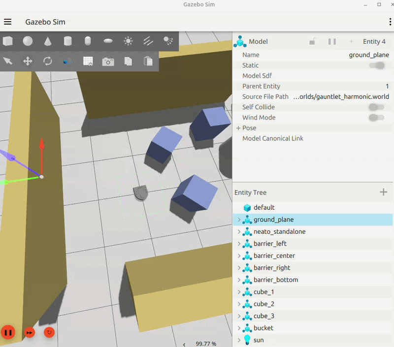
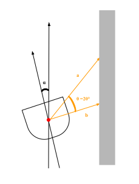
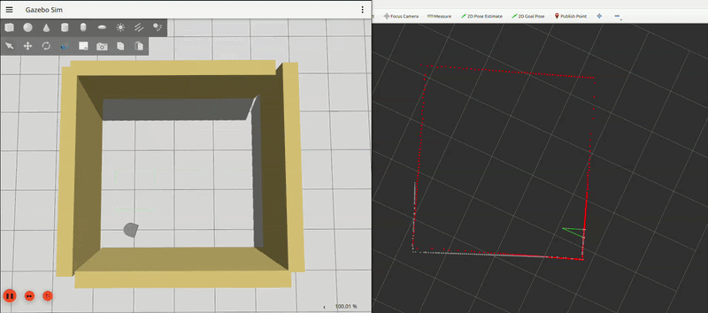
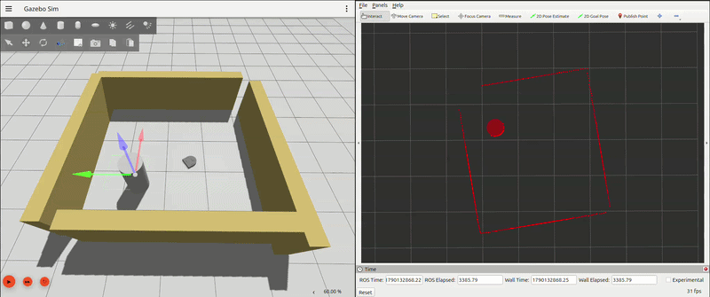
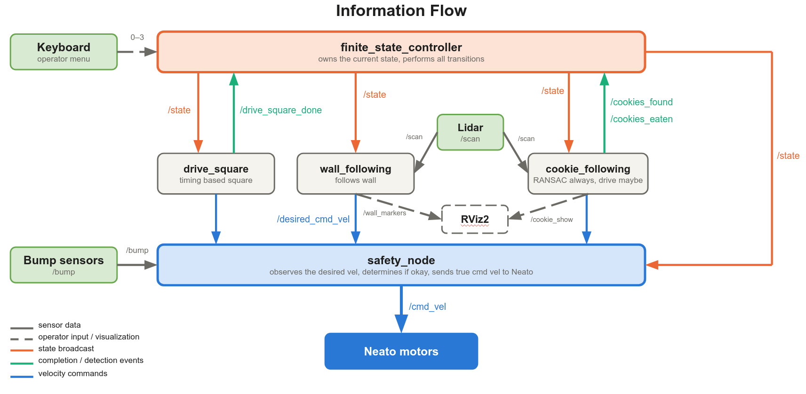
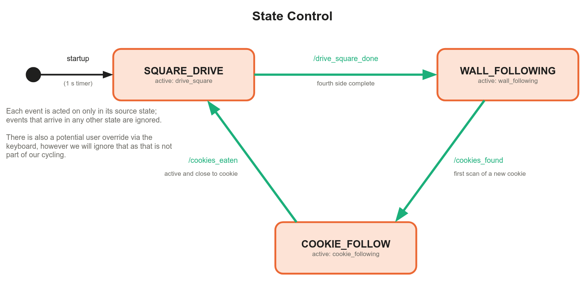

# Lazy Neato - RoboBehaviors and FSM Project

Author Names: Jack W., Enzo S., Irene H.

For Olin ENGR3590 Computational Introduction to Robotics

This README is a comprehensive report that contains both conceptual and programmatic  information regarding implementation details of our Lazy Neato project.

## 1. Project Overview

The goal of this project is to learn, experiment with, and gain overall familiarity
with ROS2, the Python framework, the robotics development cycle, and debugging
tools and practices. As detailed throughout the rest of this writeup, this
project includes not only the use of finite state machine patterns, but also a
variety of real-life robotic behaviors, such as:

- [Driving in a square](#driving-in-a-square)
- [Wall following](#wall-following)
- [Cookie following](#cookie-following)
- [Collision avoidance / safety e-stop](#collision-avoidance)

All sensors and hardware used are built into the Neato. No additional hardware or
technology is used, but advanced software techniques, including RANSAC, shape
fitting, line detection, data filtering, and proportional control, are adopted
and used in practice.

Jack mainly worked on the state machine and organizing the structure of our deliverables as well as the safety node. Enzo contributed mainly to the development of the cookie following behavior as well as outlining the basis of all the other files. Irene mainly contributed to the wall following behavior. All members came together during work meetings to discuss ideas and implemented them independently on their own time. This README, which is our report, was co-developed by all three members with their respective behaviors. 

## 2. Individual Behaviors

Here are the details of each individual behavior, discussing the programmatic implementation, the theory behind it, and how it fits into the broader architecture.

### <a name="driving-in-a-square" id="driving-in-a-square"></a>2.1 Driving in a Square
 
#### 2.1.1 Description
 
This behavior does exactly what the name suggests: the Neato drives in a square. The Neato completes the square exactly once and returns to its initial state with roughly the same position and orientation.
 
#### 2.1.2 Architecture
 
*Table 1: Square-drive node topics; subscribers and publishers with their roles and when they're called.*
 
| Topic                | Direction | Message type          | When                                          | Role                                                         |
| -------------------- | --------- | --------------------- | --------------------------------------------- | ------------------------------------------------------------ |
| `/state`             | subscribe | `std_msgs/String`     | on controller broadcast                       | Sets `is_active` true only when the state is `SQUARE_DRIVE`  |
| `/desired_cmd_vel`   | publish   | `geometry_msgs/Twist` | every timer tick (10 Hz)<br>-<br>while active | Drive or turn command sent to the safety node                |
| `/drive_square_done` | publish   | `std_msgs/String`     | once<br>-<br>after the fourth side            | Moves the controller from `SQUARE_DRIVE` to `WALL_FOLLOWING` |
 
*Table 2: Square-drive parameters.*
 
| Parameter        | Value     | Role                                                  |
| ---------------- | --------- | ----------------------------------------------------- |
| `forward_speed`  | 0.3 m/s   | linear speed during `DRIVE`                           |
| `turn_speed`     | 0.6 rad/s | angular speed during `TURN`                           |
| `drive_duration` | 3 s       | length of each `DRIVE` phase; nominal side of 0.9 m   |
| `turn_duration`  | 2.7 s     | length of each `TURN` phase; nominal turn of 1.62 rad |
| `num_sides`      | 4         | `DRIVE` phases before the square is complete          |
| timer period     | 0.1 s     | control loop rate (10 Hz)                             |
| initial `phase`  | `TURN`    | first phase on entry                                  |

#### 2.1.3 Design & Implementation
 
The drive-square behavior is implemented through a simple time-based approach. The node commands a fixed forward speed for a fixed duration to produce each side, then a fixed angular speed for a fixed duration to produce each corner. We chose this over an odometry-based controller because the square is only the first state of the FSM cycle, and its accuracy does not affect the wall-following or cookie-following behaviors. The time saved went toward those behaviors and our individual learning goals.
 
The node's only input is the `/state` topic. It publishes velocity commands on `/desired_cmd_vel` and, once the square is finished, a completion message on `/drive_square_done`. We used a separate completion topic rather than letting the node write to `/state` itself so that the FSM controller remains the only node that ever changes the state. The square node reports that it is done, and the controller decides what happens next.

In the `state_callback` function, we check if the value of `is_active` is equal to the previous one, which means that we only activate on a state change and not on every state message. This architecture is used for actuation in the other behaviors as well.
 
The motion itself runs in `run_loop`, which uses a 10 Hz timer to send its messages. If the node is inactive, the callback returns immediately and publishes nothing. Otherwise, it calls `compute_command`, which checks how long the current phase has lasted. In a `TURN` phase, the node commands `turn_speed` until `turn_duration` s have elapsed, then switches to `DRIVE`. In a `DRIVE` phase, it commands `drive_speed` until `drive_duration` s have elapsed, then increments `turns_completed` and switches back to `TURN`. Each switch records a new phase start time.
 
The square begins with a turn rather than a drive. When the robot enters `SQUARE_DRIVE` right after eating a cookie, the cookie is still directly ahead, so driving first would run into it.
 
After the fourth `DRIVE` phase, `finish_square()` clears `is_active` and publishes `DRIVE_SQUARE_DONE` on `/drive_square_done`. The command for that tick is left at zero, so the robot stops cleanly on the last side. The controller then moves to `WALL_FOLLOWING`.
 
#### 2.1.4 Limitations

Because we are not using a closed-loop approach (e.g., odometry), we never have any information about the actual state of the Neato or the square. Therefore, if a disturbance acts on the Neato, it cannot detect and react to it to still produce the square.

Additionally, we tuned the durations by observation rather than deriving them. The theoretical turn duration, derived by dividing the turn angle (90 degrees) by the angular speed, did not produce a 90-degree turn. This was likely due to a simulator bug in the original Neato SDF file that affected the wheels' grip on the surface; however, we did not deem it necessary to change afterwards, as the square was "good enough." The approach also assumes that the Neato accelerates instantaneously, which is not true.

#### 2.1.5 Demonstration

<p align="center">  </p> <p align="center"><em>Figure 1: Neato driving in a square.</em></p>

### <a name="wall-following" id="wall-following"></a>2.2 Wall Following

Basic wall following was implemented under the assumption that the walls were relatively connected, with easily identifiable corners, and did not contain small corridors. For ease of transition from the `drive_square` behavior to `wall_following`, the Neato drives parallel to the left side of the wall. However, the side of the wall is not hardcoded in the wall-following controller. The variable `self.side` determines which side is followed, allowing the Neato to trace either side of the wall if desired.

The wall-following module uses incoming `LaserScan` messages from the `/scan` topic to determine whether the Neato should continue following the wall or turn at an upcoming corner. Both parallel drive and corner handling determine angular velocity, while linear velocity is constant at $0.2\,\mathrm{m/s}$.

#### 2.2.1 Second-Order System Approximation

We model the parallel wall-following behavior as an approximate second-order system. The two quantities describing the robot relative to the wall are defined as

$$
e(t) = d(t) - d_{\mathrm{target}},
$$

$$
\alpha(t) = \text{heading error relative to the wall},
$$

where $e(t)$ is the lateral distance error and $\alpha(t)$ is the orientation error.

During parallel drive, the Neato subscribes to the `/scan` topic and uses two LiDAR points to triangulate its position and heading relative to the wall. For right-wall following, these points are `msg.ranges[270]` and `msg.ranges[290]`, while for left-wall following they are `msg.ranges[90]` and `msg.ranges[70]`. This triangulation is used to estimate the Neato's distance and heading relative to the wall, represented by $e$ and $\alpha$.

The computation for $\alpha$ is as follows:

$$
\alpha = \tan^{-1}\left(\frac{a\cos(\theta)-b}{a\sin(\theta)}\right)
$$

<p align="center">
  
</p>

The first state equation describes how the lateral distance error changes as the Neato moves forward.

$$
\dot{e} = v\sin(\alpha)
$$

If the Neato is perfectly parallel to the wall, then $\alpha=0$ and therefore $\dot{e} = v\sin(0) = 0$. Thus, there is no change in the lateral distance from the wall.

When $\alpha \neq 0$, a component of the Neato's forward velocity points toward or away from the wall, causing the distance error to change. Therefore, for small heading errors, the small-angle approximation $\sin(\alpha) \approx \alpha$ gives $\dot{e} \approx v\alpha$.

Our second state equation describes how the heading error changes with the commanded angular velocity $\omega$.

$$
\dot{\alpha} = \omega
$$

The proportional controller generates the angular velocity according to

$$
\omega = -K_e e - K_\alpha \alpha,
$$

where $K_e$ is the distance-error gain and $K_\alpha$ is the heading-error gain. Therefore,

$$
\dot{\alpha} = -K_e e - K_\alpha\alpha.
$$

Differentiating the first equation and substituting the second gives

$$
\ddot{e} = v\dot{\alpha} = -vK_e e - vK_\alpha\alpha.
$$

Since

$$
\alpha \approx \frac{\dot{e}}{v},
$$

the system can be written as

$$
\begin{aligned}
\ddot{e} + K_\alpha\dot{e} + vK_e e &= 0, \\
\omega_n &= \sqrt{vK_e}, \\
\zeta &= \frac{K_\alpha}{2\sqrt{vK_e}}.
\end{aligned}
$$

In our implementation, the distance-error gain and heading-error gain correspond to $K_e = $ `p_dist` and $K_\alpha = $ `p_angle`.

The heading-error gain was selected for critical damping, $\zeta=1$:

$$
K_\alpha = 2\zeta\sqrt{vK_e}
$$

As a result, the Neato is designed to converge toward the target wall distance as quickly as possible without oscillating in our idealized model.

#### 2.2.2 Proportional Control

The distance error, `dist_error`, is calculated as

$$
e = d - d_{\mathrm{target}},
$$

where $d$ is the estimated perpendicular distance from the wall and $d_{\mathrm{target}}=0.3\,\mathrm{m}$.

The distance error is capped before being passed to the controller

$$
e_{\mathrm{capped}} = \max\left(-e_{\max},\ \min(e_{\max},\ e)\right),
$$

keeping its response bounded. Therefore, if the two walls are not completely adjacent at a corner, the estimated distance won't suddenly change, causing the Neato to swerve in response.

The controller output is

$$
\omega = K_e e_{\mathrm{capped}} + K_\alpha\alpha,
$$

with the sign adjusted according to the selected wall-following side. The resulting angular velocity, `steer`, is also clamped:

$$
\omega_{\mathrm{cmd}} = \max\left(-\omega_{\max},\ \min(\omega_{\max},\ \omega)\right),
$$

where

$$
\omega_{\max} = \pm 1\,\mathrm{rad/s}
$$

to ensure a safe, stable, and feasible turn.

Conceptually, the two feedback terms serve different purposes. The distance-error term $K_e e$ corrects the Neato's lateral position, while the heading-error term $K_\alpha\alpha$ adjusts its orientation.

#### 2.2.3 Corner Handling

Corner handling bypasses the proportional controller used during parallel wall following. A single LiDAR measurement, `msg.ranges[0]`, measures the distance directly in front of the Neato.

A binary trigger was used to determine if the distance from the wall was under a certain threshold, $0.3\,\mathrm{m}$. However, since we did not design our Neato to turn in place, this threshold was too low for it to complete a turn before crashing into the wall. Therefore, after trial and error in simulation, a factor of 4 was chosen to amplify this threshold. If a wall was detected, we published our `/desired_cmd_vel` to turn the opposite way of `self.side`.

#### 2.2.4 Visuals & Demonstration

<p align="center">
  
</p>
<p align="center"><em>Figure 2: The wall-following behavior sped up 3x. Note the visualized wall triangle and history of wall points.</em></p>

### <a name="cookie-following" id="cookie-following"></a>2.3 Cookie Following

The goal of this behavior was to detect a circular object of known radius $R = 0.25$ m anywhere in the 360-degree scan, publish detection events to the controller, and, when active, drive to the object and report arrival, meaning that the cookie has been "eaten." These two functions run on separate schedules: the scan callback, which searches for and reports the cookie, is always active regardless of state, while driving is active only when the node's state is active. In other words, perception and actuation are decoupled in this node.

For our purposes, the "cookie" was simply the default cylinder object in the Gazebo simulator, which gave us the desired radius of $0.25$ m.

#### 2.3.1 Detection Approach

We employed the RANSAC (random sample consensus) algorithm for circle fitting to "find the cookie." This was a logical fit, given that the cookie could theoretically be anywhere in our view, and it uses the geometric fact that any three non-collinear points define a circle, so any set of lidar scan points can yield a potential circle candidate. Since our cookie has a known radius, $R$, we can discard any candidate whose radius differs from the expected radius. Additionally, because the cookie is convex and viewed externally, every visible point on the cookie is closer to the Neato than the center of the fitted circle; consequently, erroneous circles fitted to corners or other seemingly valid candidate points, which produce centers closer to the Neato, can be disregarded, filtering out flat and cornered surfaces. With these guidelines, the RANSAC algorithm repeatedly fits a model to a random sample, counts how many of the remaining points agree with this model, and keeps the model with the greatest number of inliers. RANSAC is robust to outliers, unlike a method such as least squares, which would be heavily skewed by them.

#### 2.3.2 Architecture and Scan Callback

This node subscribes to two topics and publishes to four, all of which are detailed in the table below.

*Table 1: Cookie-following node topics; subscribers and publishers with their roles and when they're called.*

| Topic              | Direction | Message type                | When                                                              | Role                                                                             |
| ------------------ | --------- | --------------------------- | ----------------------------------------------------------------- | -------------------------------------------------------------------------------- |
| `/scan`            | subscribe | `sensor_msgs/LaserScan`     | every scan <br>-<br>all states                                    | Input to RANSAC detection; this callback is what runs the node                   |
| `/state`           | subscribe | `std_msgs/String`           | on controller broadcast                                           | Sets `is_active` true only when the state is `COOKIE_FOLLOW`                     |
| `/cookies_found`   | publish   | `std_msgs/Int32`            | first detection of a new cookie<br>-<br>all states                | Moves the controller from `WALL_FOLLOWING` to `COOKIE_FOLLOW`                    |
| `/cookies_eaten`   | publish   | `std_msgs/Int32`            | once per cookie<br>-<br>on arrival while active                   | Moves the controller from `COOKIE_FOLLOW` to `SQUARE_DRIVE`                      |
| `/desired_cmd_vel` | publish   | `geometry_msgs/Twist`       | every scan <br>-<br>while active                                  | Publishes the velocity to our safety node to drive the robot after command generation |
| `/cookie_show`     | publish   | `visualization_msgs/Marker` | every detection<br>-<br>all states<br>-<br>deleted on cookie loss | Displays an RViz2 cylinder of diameter $2R$ at the fitted center, in the lidar frame |

The following table shows the parameters used in the cookie-following node and their impact on the behavior. Most of these parameters were initially chosen from a quick Google search and intuition and did not go through extensive testing to optimize performance.

*Table 2: Cookie-following parameters.*

| Parameter                   | Value              | Role                                                   |
| --------------------------- | ------------------ | ------------------------------------------------------ |
| `target_radius`             | 0.25 m             | $R$ - radius the fitted circle must match              |
| `radius_tol`                | 0.03 m             | tolerance on the fitted circle's radius difference     |
| `inlier_tol`                | 0.02 m             | how far off the circle a point can be and still count  |
| `ransac_iterations`         | 200                | $K$ - iterations of the algorithm to find the circle   |
| `min_inliers`               | 6                  | minimum support                                        |
| `sample_radius`             | 0.5 m              | $2R$ neighborhood                                      |
| `kp_linear`, `max_linear`   | 0.5 s⁻¹, 0.2 m/s   | linear speed control                                   |
| `kp_angular`, `max_angular` | 0.9 s⁻¹, 6.7 rad/s | steering control                                       |
| `stop_distance`             | 0.65 m             | arrival radius (to center)                             |
| `max_misses`                | 10 scans           | cookie-loss buffer                                     |

Everything in this behavior is executed through the `/scan` callback, which runs once per lidar message. The callback proceeds as follows:

The callback first ingests and filters the 360 range readings, discarding any value outside $(r_\text{min}, r_\text{max})$, which removes anything nearer or farther than the lidar could feasibly detect (this removes both potential zeros and any `float inf` values the lidar returns when a ray does not hit anything). It then converts the remaining points from polar coordinates (given by the lidar, where the index is the angle and the value is the distance) into Cartesian coordinates via $(r_i\cos\phi_i,\ r_i\sin\phi_i)$, where $\phi_i$ is the angle (index) and $r_i$ is the range (distance value).

The callback then runs the RANSAC circle fit on the list of points. This either returns the location of the fitted circle's center or reports that no circle was found.

A scan with no detection does not immediately mean the cookie is gone. To keep a single bad draw from ending the following behavior, the callback counts consecutive misses and keeps the current cookie position until the miss count reaches ten. At that point, the callback declares the cookie lost, clears both `tracking` and `eaten`, and deletes the RViz marker. This was implemented because RANSAC is random, so we cannot be fully confident that a cookie has been lost after a single scan.

If the fit returns a center, the callback resets the miss counter and publishes the `/cookie_show` marker at the detected center for visualization. If no track was active before this scan, this detection starts a new one. The callback sets `tracking`, increments the found count, and publishes it on `/cookies_found`; the controller uses the arrival of that message as its cue to switch from `WALL_FOLLOWING` to `COOKIE_FOLLOW`.

Next, the callback transforms the center into the robot frame and computes the cookie's range $\rho$ and bearing $\beta$. What happens after that depends on whether the node is active. An inactive node stops here and publishes no velocity, so as not to disrupt the current behavior. An active node that is still more than 0.65 m from the cookie's center publishes a velocity command on `/desired_cmd_vel`. Once the robot is within 0.65 m, the node publishes a zero velocity and, if the cookie has not been eaten yet, sets `eaten` and publishes the eaten count on `/cookies_eaten`. That message sends the controller back to `SQUARE_DRIVE`, the next state broadcast turns `is_active` off, and the cycle starts again.

#### 2.3.3 Algorithm

On each scan, the node converts the valid ranges to Cartesian points in the lidar frame and then performs $K = 200$ iterations of the following logic. In each iteration, it selects a random point $p_1$ and collects all points (by iterating through the point list) within $2R$ of it; this is the local neighborhood of the point. If the neighborhood contains fewer than two points, the iteration is skipped. It then selects $p_2$ and $p_3$ at random from the neighborhood and fits the circumcircle of the three points. This candidate is rejected if the points are nearly collinear (explained in the next section), if $|r - R| > 0.03$ m, or if the center is not farther from the sensor than $p_1$. Otherwise, the node counts the inliers, defined as scan points whose distance to the center lies within 0.02 m of $r$ (essentially, the other points on the circle), and stores this candidate as the best fit if it has the most inliers (a fit must have at least six to be valid). After all iterations, the node reports the best center (in the case of a tie, it keeps the earlier fit) or no detection.

#### 2.3.4 Circumcircle

Given points $(x_i, y_i)$, $i = 1, 2, 3$, we use the circumcircle formula to determine the center of the proposed circle as follows:

```math
D = 2\left[x_1(y_2 - y_3) + x_2(y_3 - y_1) + x_3(y_1 - y_2)\right],
```

```math
c_x = \frac{\sum_i (x_i^2 + y_i^2)(y_{i+1} - y_{i+2})}{D}, \qquad c_y = \frac{\sum_i (x_i^2 + y_i^2)(x_{i+2} - x_{i+1})}{D},
```

The magnitude $|D|$ equals four times the area of the triangle and approaches zero for collinear points. We therefore reject candidates with $|D| < 10^{-4}$ m² to prevent flat walls from producing circles of very large radius.

#### 2.3.5 Local Sampling

Sampling $p_2$ and $p_3$ from the local neighborhood greatly raises the probability of drawing three cookie points in a single iteration. This decision emerged after we realized that uniform sampling across the entire scan, with each point drawn independently, led to very low success rates in finding the circle, even though the data was qualitatively clean. The following analysis shows the extent to which local sampling helps. Let $N$ be the number of valid scan points and $n_c$ the number that lie on the cookie. Without local sampling, the probability that all three points lie on the cookie is approximately $(n_c/N)^3$; with local sampling over a $2R$ neighborhood, it rises to approximately $n_c/N$, since the other two points are essentially guaranteed to lie on the cookie if the first point does. In other words, the difference is between gambling once and gambling three times.

Local sampling assumes that no other surface lies within $2R = 0.5$ m of the cookie. This held in our testing but is not always true: when the cookie is near a wall, the two share a neighborhood, and the success rate approaches that of the uniform case. The radius $2R$ is the smallest neighborhood guaranteed to contain the entire cookie from any point on it. Another advantage of this approach is that, by using Euclidean distance rather than iterating over point indices, we handle the scan's wrap-around from 359° to 0° without special cases.

#### 2.3.6 Detection Range and Noise Sensitivity

The farther away the circle is, the fewer lidar points land on it. Intuitively, the lidar has a 1-degree angular resolution, so if you picture 360 rays spaced 1 degree apart extending from the lidar, neighboring rays are closer together on a circle 1 m away than on a circle 5 m away. Mathematically, a circle of radius $R$ whose center lies at distance $\rho$ subtends an angle $\alpha = 2\arcsin(R/\rho)$ as seen by the lidar on the Neato body. This can be derived from the geometry of the lidar and the circle. The two outermost points on the circle lie on the tangent rays from the lidar. Since every tangent line meets a circle at a right angle to the radius, the cookie's center, the tangent point, and the lidar form a right triangle. The hypotenuse is $\rho$, the distance from the lidar to the center of the circle, and the side opposite the angle at the lidar is $R$, from the center to the tangent point. This gives $\sin(\alpha/2) = R/\rho$; the angle is halved because this right triangle covers only half of the cookie, and by symmetry the full subtended angle is $\alpha = 2\arcsin(R/\rho)$. This yields a mapping from the distance of the circle to the maximum number of points that can lie on it, shown below.

*Table 3: Maximum cookie points versus distance. The drop-off is steepest at close range but continues to matter at every distance.*

| $\rho$ (m) | 1 | 2 | 3 | 4 |
|---|---|---|---|---|
| $n_c$ (points) | 29 | 14 | 9 | 7 |

In retrospect, the six-inlier requirement therefore limits detection to $\rho \le R/\sin 3^\circ$ (from the previous formula), which is about 4.8 m; however, this did not greatly impact the behavior in practice.

Conversely, closely spaced sample points make the fitted radius highly susceptible to noise. If the chord $c$, defined as the straight line from the leftmost to the rightmost point on the visible arc, were on the scale of roughly 0.1 m, then the sagitta $s$, the perpendicular distance from the chord's midpoint to the arc, would be around 5 mm, given the approximation $s \approx c^2/(8R)$. A sagitta this small is comparable to the lidar's range noise, so the fitted radius becomes essentially random; the code accounts for this with the radius-tolerance rejection. *The geometric terms used here refer to the minor arc defined by the chord and sagitta, since the lidar scan cannot see beyond a semicircle of the cookie.*

#### 2.3.7 Frame Transform
 
RANSAC runs in the lidar frame. Based on the output of `tf2_echo base_link base_laser_link`, the lidar is rotated by $\pi$ about $z$ and offset by $-0.084$ m in $x$ relative to `base_link`, which is our reference frame for the Neato. A rotation by $\pi$ negates both coordinates, so the center in the robot frame is
 
```math
\begin{bmatrix} x_b \\ y_b \end{bmatrix} = \begin{bmatrix} -0.084 - c_x \\ -c_y \end{bmatrix}, \qquad \rho = \sqrt{x_b^2 + y_b^2}, \qquad \beta = \mathrm{atan2}(y_b, x_b),
```
 
where $\beta$ is the bearing. This initially caused an issue with the debugging visualization: the marker always appeared flipped relative to the lidar points, even though the actuation logic worked correctly. This was because the rotation of the lidar by $\pi$ was negated by the fact that the first scan, as detailed within `msg.angle_min` from the Neato documentation on the class site, is recorded as $-\pi$.
 
#### 2.3.8 Control
 
The linear and angular velocity commands are as follows:
 
```math
v = \min(0.2,\; 0.5\,\rho), \qquad \omega = \mathrm{clamp}(0.9\,\beta,\ \pm 6.7),
```

and otherwise the node stops the robot. The control law is essentially constant-speed pursuit with an added proportional steering term. Looking back, we realize that the linear speed term always saturates for $\rho > 0.4$ m, and the robot only drives when $\rho > 0.65$ m, so the speed is effectively a constant 0.2 m/s throughout the state. Since $|\beta| \le \pi$, the clamp does work effectively for the angular speed. The 0.65 m stopping distance is measured to the cookie's center, which leaves 0.40 m between the Neato and the cookie's surface.

#### 2.3.9 Limitations

One of the main limitations of this implementation is that the neighborhood search is computationally expensive, as it iterates over every point. NumPy vectorization could make this more efficient in the future.

Additionally, the cookie detection has no memory or data labeling. Consequently, we could end up finding the same cookie over and over, since "eating" doesn't actually modify the state of the cylinder. Furthermore, if there were two cookies in the robot's environment, the target could jump sporadically between them.

If a cookie is found during `SQUARE_DRIVE`, the node publishes the found event, but the FSM controller does nothing with it. Then, when `WALL_FOLLOWING` becomes active, the cookie has already been found, so the transition never fires.

In `COOKIE_FOLLOW`, if the cookie is lost, the robot sits and waits; this also means that if the cookie is never found again, the robot cannot transition into any other state.

For velocity control, a simple fix would have been to scale the linear speed by a factor between 0 and $\cos(\beta)$ so that the Neato doesn't make an overly wide turn when the cookie is directly behind it.

Overall, many of these issues stem from small oversights in our planning phase and, given more time, could have been addressed for a more stable project.

<p align="center">
  
</p>
<p align="center"><em>Figure 3: The cookie-following behavior sped up 3x. Note the translucent red circle representing the cookie fitted to the surface of the arc.</em></p>

### <a name="collision-avoidance" id="collision-avoidance"></a>2.4 Collision Avoidance / Safety E-Stop

#### 2.4.1 Description & Intent

The `safety` node (`safety.py`) sits between every
other behavior node and the robot: it acts as a safety gate that all velocity
commands must pass through before reaching the Neato. Its job is to
guarantee that the robot stops immediately if it physically bumps into something,
if it's commanded into the `STOP` state, or if commands stop arriving
altogether (e.g., a crashed or hung behavior node).

#### 2.4.2 Implementation Details

The node subscribes to `desired_cmd_vel` (the
"requested" velocity published by whichever behavior node is currently
active), `bump` (the Neato's bumper sensor, `neato2_interfaces/msg/Bump`), and
`state` (the FSM's current state), and publishes the final, gated velocity to
`cmd_vel`. In `desired_cmd_vel_callback`, it forwards the message to `cmd_vel`
unless the bumper is currently triggered, in which case it publishes a zero
`Twist` instead. `bump_callback` latches `hit_bump` to `True` if any of the
four bump sensors (left front/side, right front/side) fire, and immediately
stops the robot. A periodic timer (`timecheck`, 10 Hz) also stops the robot if
no `desired_cmd_vel` message has arrived within a 1-second `TIMEOUT`, guarding
against a stalled upstream node. When the FSM publishes `state == "STOP"`, the
node stops immediately; any other state change clears the latched `hit_bump`
flag so the robot isn't stuck refusing to move after backing away from an
obstacle.

#### 2.4.3 Key Design Decisions

Collision avoidance is implemented as a downstream
safety gate rather than inside each behavior node, so every behavior (driving
in a square, wall following, cookie following) automatically gets e-stop
protection without duplicating bump-handling logic. The bumper trigger is
latched (not just checked once) so that a single bump reliably halts motion until
the state is manually changed, rather than being overridden by the very next
velocity command. The 1-second command timeout is a defensive measure
independent of the bumper, meant to catch software/communication failures
rather than physical obstacles.

#### 2.4.4 Visuals & Demonstration

See the recorded bag at
[`bags/collision_avoidance`](bags/collision_avoidance).

## 3. Finite State Machine

The choice of transitions between our states was arbitrary, so we wrote a story that explains why we chose them:

Our Neato recognizes the absurd life it lives. Students use it over and over with minimal reward. Now, our Neato has evolved into a true minimalist! The Neato works at the square-driving factory and is required to drive in a square over and over; however, this minimalist mindset makes the Neato quite lazy, and after drawing only a single square, our Neato gets tired and wants to go home. To go home, the Neato finds the closest wall and follows it - that's what its mother told it to do when lost... Yet all that hard work has made our Neato hungry. Therefore, as soon as it sees a cookie while walking home, it immediately stops thinking about home and thinks only about the cookie, rotating and driving toward it. When it gets close enough to the cookie, it eats it and, in a beautiful turn of events, finds the motivation to draw yet another square. But, of course, our Neato is still the same lazy, minimalist Neato, and after just one square, the cycle continues.

### 3.1 Overall Design

The Neato running the state machine architecture continuously loops through the cycle of behaviors. On startup, it waits, then drives a single square and reports that it has finished. Once that is complete, it switches to following the wall on its right and does so indefinitely. However, if the cookie-following node finds a cookie, the Neato leaves this state, turns toward the cookie, and attempts to eat it by driving very close to it. Once it is within eating distance, it goes back to square driving, which starts with a turn to avoid running into the cookie it just "ate," and the cycle begins again. Meanwhile, an operator can manually switch states at any time via keyboard input. The story mirrors this closely... :)

The system is made up of five nodes:

- `finite_state_controller`: owns the current state, publishes it on `/state`, and performs every transition.
- `drive_square`: drives one open-loop square and reports completion.
- `wall_following`: follows the wall on the robot's right.
- `cookie_following`: detects cookies in every state and drives to one when active.
- `safety_node`: the only node that publishes to `/cmd_vel`; acts as a safety filter for robot commands.

The controller node does not command the behaviors directly. It publishes a single state string, and each behavior node compares that string to its own state name and turns itself on or off. The behaviors report events back to the controller on their own topics, and the controller decides whether each event causes a transition.

The diagram showing the overall FSM structure is below:

<p align="center">
  
</p>
<p align="center"><em>Figure 3: Information flow between the nodes.</em></p>

*Table 8: State transitions.*

| From             | To               | Trigger              | Sent by                     | Condition at sender                           |
| ---------------- | ---------------- | -------------------- | --------------------------- | --------------------------------------------- |
| (startup)        | `SQUARE_DRIVE`   | one-shot 1 s timer   | `finite_state_controller`   | startup delay elapsed                         |
| `SQUARE_DRIVE`   | `WALL_FOLLOWING` | `/drive_square_done` | `drive_square`              | fourth side complete                          |
| `WALL_FOLLOWING` | `COOKIE_FOLLOW`  | `/cookies_found`     | `cookie_following`          | first detection of a new cookie               |
| `COOKIE_FOLLOW`  | `SQUARE_DRIVE`   | `/cookies_eaten`     | `cookie_following`          | active and within 0.65 m of the cookie center |
| any              | any              | keyboard `0`–`3`     | controller input thread     | operator input                                |

The diagram showcasing the transition logic is below:

<p align="center">
  
</p>
<p align="center"><em>Figure 4: State transitions of the finite-state controller.</em></p>
 
### 3.2 Architecture
 
*Table 9: Finite-state controller topics; subscribers and publishers with their roles and when they're called.*
 
| Topic                | Direction | Message type      | When                                                                  | Role                                                             |
| -------------------- | --------- | ----------------- | --------------------------------------------------------------------- | ---------------------------------------------------------------- |
| `/state`             | publish   | `std_msgs/String` | 1 s after startup<br>-<br>on every transition<br>-<br>on keyboard input | Broadcasts the current state to every behavior and the safety node |
| `/drive_square_done` | subscribe | `std_msgs/String` | once per square                                                       | `SQUARE_DRIVE` to `WALL_FOLLOWING`                               |
| `/cookies_found`     | subscribe | `std_msgs/Int32`  | first detection of a new cookie                                       | `WALL_FOLLOWING` to `COOKIE_FOLLOW`                              |
| `/cookies_eaten`     | subscribe | `std_msgs/Int32`  | once per cookie, on arrival                                           | `COOKIE_FOLLOW` to `SQUARE_DRIVE`                                |
 
*Table 10: Finite-state controller parameters.*
 
| Parameter          | Value                                                    | Role                                         |
| ------------------ | -------------------------------------------------------- | -------------------------------------------- |
| initial state      | `SQUARE_DRIVE`                                           | state published at startup                   |
| startup timer      | 1.0 s                                                    | delay before the first `/state` publish so subscribers can connect |
| keyboard mapping   | `1` `SQUARE_DRIVE`, `2` `WALL_FOLLOWING`, `3` `COOKIE_FOLLOW`, `0` `STOP` | manual override from any state |
 
### 3.3 Implementation Details
 
The controller is implemented in `finite_state_controller.py` as the `FiniteStateController` node. It stores the current state as a string in `current_state`, and every change goes through a single method, `set_state()`, which updates `current_state`, publishes the new value on `/state`, and prints it to the terminal. Because nothing else publishes on `/state`, the terminal output is a complete log of every transition the robot made.
 
 
The keyboard menu runs in a separate thread started in the arbiter. `terminal_input_loop` prints the menu, blocks on `input()`, maps `1`, `2`, `3`, and `0` to `SQUARE_DRIVE`, `WALL_FOLLOWING`, `COOKIE_FOLLOW`, and `STOP`, respectively, and calls `set_state()` directly. Running it in its own thread lets the menu wait for input while `rclpy.spin()` keeps servicing the event callbacks on the main thread. Marking it as a daemon lets the program exit without waiting for the blocked `input()` call to return. Invalid input prints an error and redisplays the menu without changing the state.
 
 
### 3.4 Limitations
 
As mentioned in the individual behavior sections, our state machine has many limitations and unhandled edge cases. The controller has no way out of `COOKIE_FOLLOW` except eating a cookie. If the cookie is lost, the cookie-following node stops publishing velocity, and the robot sits still until a cookie reappears or an operator changes the state from the keyboard. Because the found event fires only at the start of a new track, a cookie first seen while the robot is still drawing its square is ignored by the controller and never triggers a transition later, even if it stays in view during wall following.
 
Additionally, the 1 s startup delay is a guess and has not been verified. If the delay were too short for the subscribers to connect, they would miss the initial state, and the state machine would never start cycling.

## 4. Learning Objectives and Final Takeaways

Enzo - Through the development of this project, I've been able to learn much more about the fundamentals of ROS programming and develop a better intuition for how to approach problems with this mindset. Through working on cookie following, I've had the opportunity to encounter problems that arise under unique environments. For example, my earlier iterations of the RANSAC algorithm worked when the cookie was the only thing the lidar saw, and then when I added another object, it didn't work as well. Then, adding four walls made it even worse. Through this, I learned how important it is to treat the last step as the first when thinking about developing my algorithms so that I don't have to encounter the problem before I solve it. Additionally, I learned more about transforms, although this did not greatly impact the algorithms I implemented. Unfortunately, I also have developed a better understanding of categorizing the problems I encounter into either solvable or non-solvable problems. For instance, I assume that I have an estimated 10 hours attempting to debug problems that arose from the SDF file of the Neato. Originally, I had lidar issues since the Neato was in the floor at times. Then, after I attempted to fix the SDF, I removed that issue but silently introduced another issue with wheel turning that I hadn't realized, so when I worked on the project at a later time, things that had worked prior seemingly were broken. Overall, through just the experience of trying to get everything to work, I've exposed myself to so many elements of the robotics experience that I feel more comfortable moving forward with any project. 

Irene: Over the course of the project, I've gained familiarity with ROS, Gazebo, rviz, and basic terminal commands. I've improved my coding abilities by understanding how to translate a vision of our system architecture into real code, while ensuring that there is room to scale up its complexity. As I optimized the wall following code, I realized just how important it is to not hard-code any parameters or functions and to leave flexibility to test for various edge cases. I also saw just how useful the simulations were, not only because it had ideal conditions but also because I could build another world to isolate controls and test different behaviors. This was an unexpected but very helpful way for me to debug my work. Additionally, as I focused on more tedious work like creating visualization, I came to appreciate the long tutorials and documentation that was provided. Initially, I used LLMs to translate the tf and Marker guides from C++ to Python as well as to create my display framework. However, as issues arose with the transforms not operating properly (and lidar scans being rotated on the odom frame) I quickly realized that AI was useful for creating a simple foundation, but that official documentation and original thought was always more effective at producing an understandable and functional final product. In the end, I am grateful for the takeaways I had from the project and am excited to use my newly advanced skills to create even more creative and interesting robotics projects in the future. 

Jack - This project allowed me to get a deep dive into the development cycle and practices used in industrial robotics development. I was able to both practice using advanced debugging tools and techniques as well as understanding why they are used and when to use them, which directly corresponded to my learning goal of becoming familiar with industrial practices. One of the takeaways from this project is that, spending more time designing the architecture and system improves the clarity and efficiency of the implementation later on. One of the biggest design decisions we had was using a centralized FSM node rather than distributed state switching at each node. Before writing any code, we all came together and drew out diagrams after discussing. We were able to split up tasks to work on in parallel efficiently. Even when we misunderstood the FSM requirement in the beginning, this approach enabled us to quickly change and iterate to the new designs later on with minimum structural changes. This also enabled us to conduct unit testing and parallel development efficiently, which was crucial to the team collaboration processes. It was also important to set these design principles at first and follow them consistently throughout the program. For example, we have intentionally designed our FSM controller to be the only node writing to the topic `/state`. Making this design decision early and following this throughout had allowed us to keep our nodes and topics in an organized way to understand and maintain. For future improvements, I would wish to have more time to dive into more advanced techniques on each of these behaviors or more, such as adding odometry, sensor information, careful tuning, etc.

## 5. How To Run
 
### 5.1 Prerequisites
 
The package runs on ROS 2 with the CompRobo Neato packages installed in the same workspace. These provide the simulator worlds (`neato2_gazebo`), the physical-robot driver (`neato_node2`), and the bump message type used by the safety node (`neato2_interfaces`). The tutorial for installing these can be found on the CompRobo website at: https://comprobo26.github.io/How%20to/setup_your_environment
 
We tested all of our code with the standard ROS2 Jazzy distribution.
 
### 5.2 Download and Build
 
Clone the repository into the `src` folder of your ROS 2 workspace, then build the package and source the workspace from the workspace root:
 
```bash
cd ~/ros2_ws/src
git clone https://github.com/enzolaj/ros_behaviors_fsm
cd ~/ros2_ws
colcon build --packages-select ros_behaviors_fsm
source install/setup.bash
```
 
### 5.3 Running in Simulation
 
Start a simulated world in one terminal. 
 
```bash
ros2 launch neato2_gazebo neato_gauntlet_world.py
# or
ros2 launch neato2_gazebo empty_world.py
```
 
If you want to test cookie following, add a cylinder of radius 0.25 m to the world from Gazebo's insert menu. The default Gazebo cylinder has this radius. This is also naturally in the gauntlet world, but many other objects are there as well.
 
In a second terminal, start all of the behavior nodes:
 
```bash
ros2 launch ros_behaviors_fsm all_nodes_launch.py
```

These are all of the behavior nodes. To then see the cycle begin, we launch the FSM node:
```bash
ros2 run ros_behaviors_fsm finite_state_controller
```
In this state, you will see potential user input printed to the terminal it was run in. This allows you to manually override any state commands as you see fit.

### 5.4 Visualization
You can visualize the topics in Rviz2. To do this, run:
```bash
rviz2
```
This will open RViz, which you can then add the special visualization topics:

- `LaserScan` on `/scan`, to see the raw lidar points.
- `Marker` on `/cookie_show`, to see the fitted cookie cylinder.
- `MarkerArray` on `/wall_markers`, to see what the Neato thinks is the wall its following.

## 6. Tool Usage
Throughout the development of this project, we did use AI tools, such as LLMs, to assist with certain programming. We were conscious of the effect this had on our project and mainly used it to assist with the visualization aspects within our files. For example, I (Enzo) used Claude to help me understand what was the problem with my marker visualization in the cookie_follow.py file. This then helped me realize what was occurring between the frames and that is independent thought. 
Furthermore, this write up was first written in Obsidian, with is a text editor with additional tools. This enhanced our ability to easily integrate tables in the `.md` format, as it was essentially just a fancier Google Docs for our purposes. Additionally, members have used certain AI to help scaffold their ideas and carve out higher level organization so they may focus on other details related to the project in writing. 
